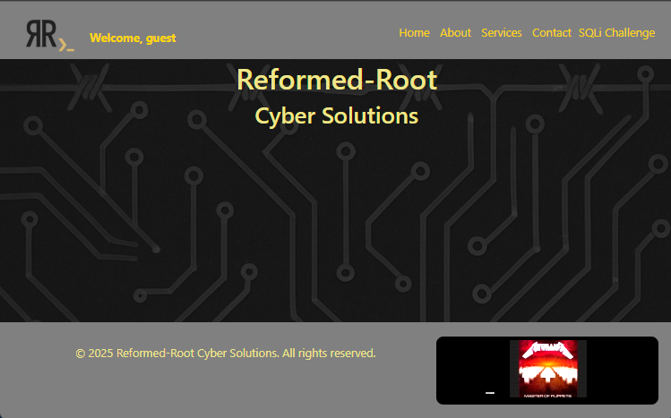
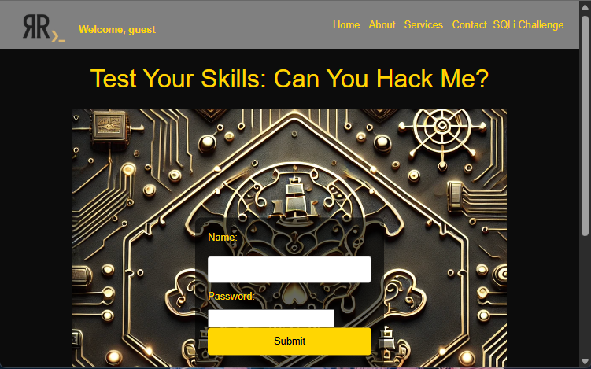

## FlaskApp
 A Flask-based web application with a CTF-style SQLi challenge, session-based access control, and learning-focused features.

## 📸 Screenshots

### 🏠 Home Page


---

### 💀 SQLi Challenge



## 🚀 Features
 - Home page with navigation bar and music player
 - CTF-style SQL Injection challenge with login form
 - Session-based access control for challenge pages
 - Static file serving (videos, images, favicons)
 - Template-driven pages for easy customization
 - Blueprint-based modular Flask design

## 📦 Project Structure

```
FLASKAPP/
│
├── instance/
├── venv/                     # Virtual environment
├── website/                  # Main Flask app package
│   ├── static/               # Static files (images, CSS, JS)
│   ├── templates/            # Jinja2 HTML templates
│   ├── auth.py               # Authentication logic for challenge
│   ├── views.py              # Route definitions
│   ├── __init__.py           # Flask app initializer (if used)
│   ├── .gitignore            # Excluded files for this subfolder
│   └── secrets.txt           # DB credentials (ignored in Git)
├── flaskapp.wsgi             # WSGI entrypoint for deployment
├── main.py                   # App runner or entrypoint
└── README.md                 # Project documentation
```


## ⚙️ Requirements
 - Python 3.12+
 - Flask
 - PyMySQL (for connecting to MariaDB)

## 🗄️ Database
 - Backend: MariaDB
 - Table: `submissions` with columns:
  - id (Primary Key)
  - name (Username)
  - password (stored in plain text for challenge)

## 🔐 Secrets Management
 - secrets.txt (excluded from git)

 Example format:
 - DB_USER=your_db_username
 - DB_PASSWORD=your_db_password
 - DB_NAME=your_database_name

